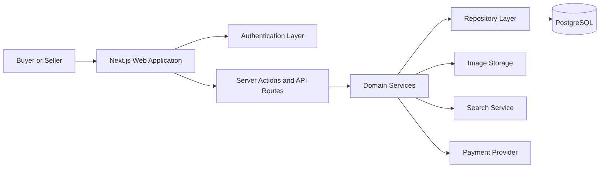
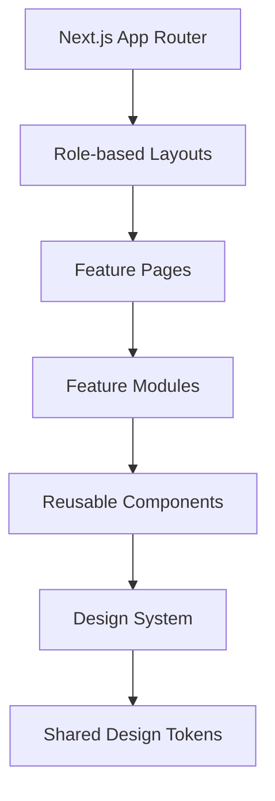
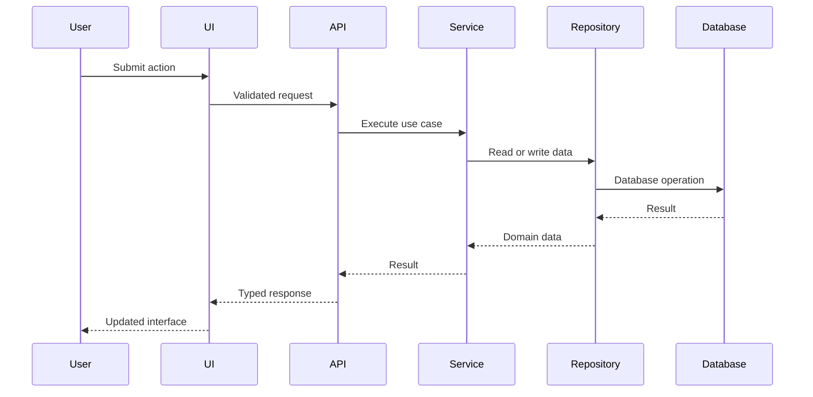

# Codex Engineering Standards and Architecture Rules

## 1. Purpose

This document defines the engineering, architecture, coding, styling, testing, documentation, and delivery standards for the 3D-printing marketplace project.

The goal is to keep the codebase:

- Clean
- Predictable
- Reusable
- Strictly typed
- Easy to maintain
- Easy to test
- Easy to extend
- Easy for new developers to understand

Codex must follow this document before creating or modifying application code.

---

## 2. Core Implementation Expectations

Build the application as a production-ready, full-stack TypeScript project.

Before creating application code:

1. Analyse the complete product requirement.
2. Identify user roles, major domains, entities, workflows, and dependencies.
3. Propose the frontend, backend, database, authentication, storage, search, and deployment architecture.
4. Create the folder structure.
5. Add architectural diagrams to `README.md`.
6. Explain the implementation phases.
7. Begin implementation only after the architecture is documented.

Do not begin by generating disconnected pages or isolated components.

The implementation must follow:

- Domain-oriented architecture
- Component-driven development
- Clear separation of concerns
- Reusable design-system patterns
- Typed API and domain contracts
- Incremental delivery

---

## 3. Technology Requirements

Use the latest stable and mutually compatible versions of:

- Next.js with App Router
- React
- TypeScript
- Node.js
- Tailwind CSS
- SCSS
- SCSS Modules
- PostgreSQL
- Prisma ORM
- Auth.js
- React Hook Form
- Zod
- TanStack Query where client-side server-state management is required
- Jest
- React Testing Library
- `user-event`
- ESLint
- Prettier

Do not install unnecessary packages.

Before adding a dependency:

1. Confirm that it solves a real requirement.
2. Confirm that it is actively maintained.
3. Confirm compatibility with the selected React and Next.js versions.
4. Prefer framework-native functionality when it is sufficient.
5. Do not invent package names, APIs, configuration fields, or library capabilities.

The entire codebase must use TypeScript.

Use:

- `.ts` for models, utilities, configuration, services, repositories, and server code
- `.tsx` for React components, layouts, and pages
- `.module.scss` for component-specific SCSS
- `.test.ts` and `.test.tsx` for Jest tests

Do not create JavaScript implementation files.

---

## 4. TypeScript Standards

Use strict TypeScript configuration.

Recommended compiler options:

```json
{
  "compilerOptions": {
    "strict": true,
    "noImplicitAny": true,
    "strictNullChecks": true,
    "noUncheckedIndexedAccess": true,
    "exactOptionalPropertyTypes": true,
    "noFallthroughCasesInSwitch": true,
    "forceConsistentCasingInFileNames": true
  }
}
```

Do not use:

- `any`
- unnecessary type assertions
- `@ts-ignore`
- `@ts-nocheck`
- unsafe non-null assertions
- duplicated interfaces
- untyped API responses
- untyped event handlers

Use `unknown` when a value is genuinely unknown and narrow it safely.

Prefer:

- Interfaces for extendable object contracts
- Type aliases for unions, intersections, and utility types
- Discriminated unions for state variants
- Readonly data where mutation is unnecessary
- Explicit return types for shared functions
- Typed route parameters
- Typed API request and response contracts
- Shared domain models
- Narrow, purpose-specific types

Keep domain models independent from presentation components.

---

## 5. Modern JavaScript and ES Standards

Use modern ECMAScript syntax supported by the selected project environment.

Prefer:

- `const` over `let`
- Arrow functions where appropriate
- Destructuring
- Object shorthand
- Optional chaining
- Nullish coalescing
- Array methods
- `async` and `await`
- Named exports
- Immutable transformations
- Early returns
- Pure utility functions
- Small and focused functions

Avoid:

- `var`
- Nested ternaries
- Excessive conditional nesting
- Mutation-heavy code
- Callback chains
- Duplicated logic
- Large functions
- Unclear abbreviations
- Magic numbers
- Magic strings

---

## 6. Source-Code Comments

Do not add comments inside generated source-code files.

Do not generate:

- Inline comments
- Block comments
- Commented-out code
- Placeholder comments
- TODO comments
- Explanatory comments above functions
- Redundant comments describing obvious code

Code must remain understandable through:

- Meaningful names
- Small functions
- Explicit types
- Clear file organisation
- Predictable component APIs
- Domain-specific naming
- Focused responsibilities

Documentation belongs in:

- `README.md`
- Architecture documentation
- API documentation
- Storybook documentation, when Storybook is used

Avoid comments in configuration files unless a tool explicitly requires them.

---

## 7. Folder Architecture

Use a domain-oriented structure similar to:

```text
src/
├── app/
│   ├── (auth)/
│   ├── (buyer)/
│   ├── (seller)/
│   ├── (admin)/
│   ├── api/
│   ├── layout.tsx
│   ├── page.tsx
│   └── globals.scss
├── components/
│   ├── ui/
│   ├── layout/
│   ├── feedback/
│   └── forms/
├── features/
│   ├── authentication/
│   ├── catalogue/
│   ├── categories/
│   ├── products/
│   ├── search/
│   ├── cart/
│   ├── checkout/
│   ├── orders/
│   ├── sellers/
│   ├── reviews/
│   ├── favourites/
│   └── administration/
├── models/
├── services/
├── repositories/
├── hooks/
├── lib/
├── utils/
├── constants/
├── config/
├── styles/
│   ├── abstracts/
│   ├── base/
│   ├── tokens/
│   └── utilities/
├── test/
│   ├── fixtures/
│   ├── mocks/
│   └── utils/
└── types/
```

Each feature should follow a predictable internal structure:

```text
features/products/
├── api/
├── components/
├── hooks/
├── models/
├── schemas/
├── services/
├── utils/
├── tests/
└── index.ts
```

Do not create empty folders.

Create a folder only when it represents a real responsibility.

Avoid deep nesting without a clear architectural reason.

---

## 8. Barrel Exports

Every reusable folder must expose its public API through an `index.ts` file.

Example:

```text
components/ui/button/
├── Button.tsx
├── Button.module.scss
├── Button.model.ts
├── Button.test.tsx
└── index.ts
```

The `index.ts` file should export only the public API:

```ts
export { Button } from './Button';
export type { ButtonProps } from './Button.model';
```

Consumers should import from the folder:

```ts
import { Button } from '@/components/ui/button';
```

Avoid importing internal files directly:

```ts
import { Button } from '@/components/ui/button/Button';
```

Do not create one global barrel file that exports the entire application.

Use local feature and component barrels to reduce circular dependency risk.

---

## 9. Model Files

Reusable components, domain entities, and API contracts must have clearly defined model files.

Use meaningful file names:

```text
Product.model.ts
Seller.model.ts
Order.model.ts
ProductCard.model.ts
SearchFilters.model.ts
```

A model file may contain:

- Interfaces
- Enums
- Union types
- API request types
- API response types
- Component prop types
- Domain constants that are tightly related to the model

Do not mix domain models with:

- Styling logic
- Rendering logic
- Data-fetching logic
- Framework-specific behaviour

Do not duplicate the same entity definition across multiple features.

Create separate contracts when responsibilities differ:

```ts
Product
ProductSummary
ProductDetails
CreateProductInput
UpdateProductInput
ProductApiResponse
```

Do not use one oversized interface for every workflow.

---

## 10. Reusable Component Standards

Build a reusable component system before creating complete feature pages.

Create reusable primitives where required:

- Button
- IconButton
- Input
- Textarea
- Select
- Checkbox
- RadioGroup
- Badge
- Chip
- Card
- Modal
- Drawer
- Tooltip
- Dropdown
- Pagination
- Breadcrumb
- Tabs
- Skeleton
- EmptyState
- ErrorState
- LoadingIndicator
- ProductCard
- PriceDisplay
- RatingDisplay
- QuantitySelector
- SearchInput
- ImageGallery
- FormField

Use native HTML elements whenever possible.

Do not create wrapper components without a clear benefit.

Do not duplicate:

- Markup
- Accessibility behaviour
- Interaction logic
- Validation behaviour
- Loading states
- Error states
- Focus handling
- Variant logic

Reusable components must support:

- Typed props
- Keyboard interaction
- Accessible names
- Visible focus states
- Disabled states
- Loading states where relevant
- Responsive behaviour
- Predictable variants
- Test coverage

Do not introduce a large component library unless it is explicitly required.

Prefer project-owned reusable components built on accessible native primitives.

A specialised library may be used for complex accessibility behaviour such as:

- Dialogs
- Popovers
- Dropdown menus
- Comboboxes

Document the reason in `README.md`.

---

## 11. Styling Architecture

Use Tailwind CSS and SCSS with clearly separated responsibilities.

### Tailwind CSS responsibilities

Use Tailwind CSS for:

- Page layout
- Grid
- Flexbox
- Spacing
- Sizing
- Responsive breakpoints
- Common typography
- Common interaction states
- Simple borders
- Simple shadows
- Alignment
- Visibility utilities

### SCSS Modules responsibilities

Use SCSS Modules for:

- Complex component styling
- Animations
- Pseudo-elements
- Advanced selectors
- State combinations
- Third-party overrides
- Styles that would otherwise create unreadable utility strings
- Tightly scoped component-specific styling

Do not define the same style in both Tailwind and SCSS.

Do not place large amounts of component styling in `globals.scss`.

---

## 12. Design Tokens

Create a central token system.

Recommended structure:

```text
src/styles/
├── tokens/
│   ├── _colors.scss
│   ├── _typography.scss
│   ├── _spacing.scss
│   ├── _radius.scss
│   ├── _shadows.scss
│   ├── _breakpoints.scss
│   └── _index.scss
├── abstracts/
│   ├── _functions.scss
│   ├── _mixins.scss
│   └── _index.scss
├── base/
│   ├── _reset.scss
│   ├── _fonts.scss
│   └── _index.scss
└── globals.scss
```

Define runtime theme tokens as CSS custom properties:

```scss
:root {
  --color-brand-primary: #15803d;
  --color-brand-primary-hover: #166534;
  --color-brand-primary-active: #14532d;

  --color-surface-page: #f8fafc;
  --color-surface-card: #ffffff;
  --color-surface-muted: #f1f5f9;

  --color-text-primary: #0f172a;
  --color-text-secondary: #475569;
  --color-text-disabled: #94a3b8;
  --color-text-inverse: #ffffff;

  --color-border-default: #e2e8f0;
  --color-border-strong: #cbd5e1;

  --color-status-success: #15803d;
  --color-status-warning: #b45309;
  --color-status-error: #b91c1c;
  --color-status-info: #0369a1;

  --radius-small: 0.375rem;
  --radius-medium: 0.625rem;
  --radius-large: 1rem;
  --radius-pill: 9999px;

  --shadow-small: 0 1px 2px rgb(15 23 42 / 0.08);
  --shadow-medium: 0 6px 20px rgb(15 23 42 / 0.1);
  --shadow-large: 0 18px 45px rgb(15 23 42 / 0.14);
}
```

These values are examples.

Final values must match the approved visual design.

Use semantic token names.

Prefer:

```scss
color: var(--color-text-primary);
```

Avoid:

```scss
color: #0f172a;
```

Do not hardcode repeated:

- Colours
- Spacing values
- Border radii
- Shadows
- Typography sizes
- Breakpoints
- Z-index values

Use the central token system.

---

## 13. Tailwind Integration

Map Tailwind utilities to shared CSS variables.

The exact configuration must follow the selected Tailwind version and its official configuration model.

Intended usage:

```tsx
<div className="bg-surface-card text-text-primary border-border-default">
```

Tailwind classes must resolve to central design tokens rather than repeated raw values.

Avoid repeated arbitrary values:

```tsx
<div className="bg-[#15803d] rounded-[10px]">
```

Prefer token-based utilities:

```tsx
<div className="bg-brand-primary rounded-medium">
```

An arbitrary value is acceptable only when:

- It represents a genuinely unique design requirement
- It is not repeated
- It does not reasonably belong in the design system

---

## 14. Theme Support

Prepare the styling architecture for central theme overrides.

The initial application should use the approved green marketplace theme.

Support future theming through token overrides:

```scss
[data-theme='dark'] {
  --color-surface-page: #020617;
  --color-surface-card: #0f172a;
  --color-text-primary: #f8fafc;
  --color-text-secondary: #cbd5e1;
  --color-border-default: #334155;
}
```

Dark mode should only be implemented when it is part of the approved product scope.

The token architecture should still make future theme support straightforward.

---

## 15. SCSS Standards

Use SCSS Modules with component-scoped class names.

Example:

```text
ProductCard.tsx
ProductCard.module.scss
ProductCard.model.ts
ProductCard.test.tsx
index.ts
```

Import styles using:

```tsx
import styles from './ProductCard.module.scss';
```

Avoid:

- Global component classes
- Deeply nested selectors
- Nesting beyond three levels
- `!important`
- Duplicated token values
- ID selectors
- Fragile DOM-dependent selectors
- Styling generated framework class names
- Global selectors for local component behaviour

Prefer modifier classes and data attributes:

```tsx
<article
  className={styles.root}
  data-featured={featured}
  data-disabled={disabled}
/>
```

Keep each SCSS file focused on its associated component.

---

## 16. Class-Name Management

Use a small, reliable class-name utility when conditional classes become difficult to read.

Do not manually build long template strings with many conditions.

Keep Tailwind class strings readable by grouping:

1. Layout
2. Spacing
3. Typography
4. Visual styles
5. Interaction states
6. Responsive states

Extract repeated class combinations into:

- Reusable components
- Variants
- Shared design-system patterns

Do not create abstractions for one-time class strings.

---

## 17. Responsive Design

Use a mobile-first implementation.

Support at minimum:

- Mobile
- Tablet
- Laptop
- Desktop

Validate the interface at representative widths:

- 360 px
- 768 px
- 1024 px
- 1280 px
- 1440 px

Do not build desktop-only pages and patch mobile behaviour later.

Product grids, navigation, filters, forms, dashboards, and tables must respond appropriately.

Avoid forcing unreadable desktop tables onto mobile screens.

Use an appropriate mobile alternative where required.

---

## 18. Accessibility

Target WCAG 2.2 AA practices.

Every interactive component must include:

- Visible keyboard focus
- Keyboard operability
- Semantic HTML
- Appropriate labels
- Accessible error messages
- Sufficient colour contrast
- Disabled-state communication
- Loading-state communication
- Predictable focus order

Use `aria-*` attributes only when semantic HTML is insufficient.

Do not add unnecessary ARIA roles.

Images must use meaningful alternative text when informative.

Decorative images must use:

- Empty alternative text
- Decorative background implementation
- Appropriate hidden semantics where needed

Forms must correctly associate:

- Labels
- Descriptions
- Hints
- Validation messages
- Error messages

---

## 19. React and Next.js Standards

Use Server Components by default.

Use Client Components only when the component requires:

- Local interactive state
- Browser APIs
- Event handlers
- Client-side data fetching
- Client-only libraries

Do not mark an entire page as a Client Component when only a child requires client behaviour.

Separate:

- Presentation
- Data access
- Domain logic
- Validation
- Persistence
- Request handling
- Authorisation

Use repository and service layers when they simplify domain logic.

Do not create layers that only forward arguments without adding value.

---

## 20. State Management

Use the simplest state-management approach that fits the requirement.

Prefer:

- Server Components for server-owned data
- URL search parameters for filters, sorting, and pagination
- Local component state for isolated UI interactions
- React Hook Form for forms
- TanStack Query for client-side server-state workflows
- Context only for genuinely shared UI state

Do not introduce a global state-management library without a concrete need.

Avoid duplicating server state in multiple places.

Do not store derived data when it can be computed safely.

---

## 21. Validation and API Contracts

Use Zod schemas for:

- Form validation
- API input validation
- Environment-variable validation
- External response validation where required
- Search parameter parsing
- Route parameter parsing

Do not trust client input.

Share schemas between client and server only when it does not expose server-only implementation details.

Return consistent API response shapes.

Use appropriate HTTP status codes.

Do not expose:

- Raw database errors
- Stack traces
- Internal service details
- Sensitive identifiers
- Authentication secrets

---

## 22. Authentication and Authorisation

Authentication and authorisation must be enforced on the server.

Support the required roles:

- Buyer
- Seller
- Administrator

Do not rely only on hiding buttons or navigation links.

Protected operations must validate:

- Authentication state
- User role
- Resource ownership
- Permission level
- Request validity

Unauthorised and forbidden states must be handled separately.

---

## 23. Data Access and Repository Standards

Database operations should be isolated from rendering code.

Use repositories when they provide:

- Query reuse
- Clear persistence boundaries
- Testability
- Domain-oriented data access

Do not expose Prisma directly throughout the entire application.

Repository methods must use domain-specific names.

Prefer:

```ts
findPublishedProducts
findSellerProducts
createProductDraft
updateInventoryQuantity
```

Avoid vague names such as:

```ts
getData
fetchItems
runQuery
```

---

## 24. Error Handling

Handle errors at appropriate boundaries.

Include:

- Route-level error states
- Not-found states
- Form validation errors
- API error responses
- Network failure states
- Empty states
- Authentication failures
- Authorisation failures
- Payment failures
- Inventory conflicts

Do not silently catch errors.

Do not show technical database or server messages to users.

Provide clear recovery actions where possible.

---

## 25. Testing Standards

Use Jest and React Testing Library.

Each reusable component should have a colocated test file.

Example:

```text
Button.tsx
Button.model.ts
Button.module.scss
Button.test.tsx
index.ts
```

Test user-observable behaviour rather than internal implementation.

Cover:

- Default rendering
- User interactions
- Keyboard behaviour
- Disabled state
- Loading state
- Validation behaviour
- Conditional content
- Accessible labels
- Error conditions
- Empty states
- Successful API interactions
- Failed API interactions
- Permission states

Prefer semantic queries:

```ts
screen.getByRole('button', { name: /add to cart/i });
```

Avoid:

- Testing private functions directly
- Snapshot tests as the main strategy
- Querying CSS classes
- Querying fragile DOM structures
- Asserting internal React state
- Testing implementation details

Use fixtures and factories for repeated test data.

Create shared test-rendering utilities for providers such as:

- Authentication
- Routing
- Query clients
- Theme
- Feature flags

Do not reduce test quality only to make a failing test pass.

---

## 26. Naming Conventions

Use:

- `PascalCase` for components, classes, interfaces, and type aliases
- `camelCase` for variables, functions, and hooks
- `UPPER_SNAKE_CASE` for true constants
- `kebab-case` for route segments
- `use` prefix for React hooks
- `is`, `has`, `can`, or `should` prefixes for booleans

Examples:

```ts
isLoading
hasPermission
canEditProduct
shouldDisplayDiscount
```

Avoid vague names:

```ts
data
item
obj
temp
res
val
handleThing
```

Prefer domain-specific names:

```ts
productSummary
sellerProfile
orderLineItems
searchFilters
handleProductSelection
```

---

## 27. Function and File Responsibility

Keep files focused.

General guidance:

- React components should usually remain under 200 lines
- Utility functions should remain small
- Large forms should be split into meaningful sections
- Feature components should be decomposed by responsibility
- Services should represent clear use cases
- Repositories should represent persistence operations
- Models should contain contracts, not behaviour

Do not split a clear, small component into unnecessary files only to satisfy a pattern.

Architectural clarity is more important than arbitrary line counts.

---

## 28. Import Standards

Use path aliases for stable project-level imports.

Example:

```ts
import { Button } from '@/components/ui/button';
import { ProductCard } from '@/features/products';
```

Use relative imports only for files within the same small module.

Avoid:

- Deep relative imports
- Circular dependencies
- Importing internal files across module boundaries
- Default exports for reusable modules unless the framework requires them
- Wildcard exports that hide module ownership

Keep imports ordered and linted consistently.

---

## 29. Documentation Requirements

Create a detailed `README.md` containing:

1. Product overview
2. User roles
3. Key workflows
4. Technology stack
5. Architecture decisions
6. Folder structure
7. Data-flow explanation
8. Database overview
9. Authentication and authorisation approach
10. Styling architecture
11. Design-token strategy
12. Testing strategy
13. Local setup
14. Environment variables
15. Database migration steps
16. Seed-data instructions
17. Available scripts
18. Deployment instructions
19. Known limitations
20. Future improvements

Documentation must reflect the actual implementation.

Do not document planned behaviour as completed behaviour.

---

## 30. Required Architecture Diagrams

Include Mermaid diagrams inside `README.md`.

### High-Level Architecture



### Frontend Composition



### Request Flow



Adjust diagrams to reflect the final implementation.

---

## 31. Quality Controls

Before considering a feature complete:

1. TypeScript must compile without errors.
2. ESLint must pass.
3. Tests must pass.
4. Production build must pass.
5. Imports must resolve correctly.
6. No unused files or imports may remain.
7. No duplicated raw design values should remain.
8. No fake APIs may be presented as completed integrations.
9. No placeholder business logic may be represented as production logic.
10. No credentials or secrets may be committed.
11. Responsive behaviour must be checked.
12. Accessibility behaviour must be checked.
13. Error states must be implemented.
14. Loading states must be implemented.
15. Empty states must be implemented.
16. Authorisation must be enforced on the server.
17. Database migrations must be valid.
18. README documentation must match the codebase.

---

## 32. External Integration Rules

When an external integration cannot be completed without credentials, provide:

- A typed adapter interface
- A safe local implementation or mock
- Environment-variable requirements
- Clear integration instructions in `README.md`
- Explicit limitations

Do not claim that an integration is working unless it has been configured and verified.

This applies to:

- Payments
- File storage
- Email
- Search providers
- Analytics
- Shipping
- Notifications
- External authentication
- AI services

---

## 33. Codex Implementation Discipline

Do not generate the entire platform as one uncontrolled code dump.

Work in phases.

At the beginning of every phase:

1. Inspect the existing repository.
2. Read the current architecture and conventions.
3. Identify files that will be created or modified.
4. Confirm required dependencies.
5. Implement only the current phase.
6. Run type checking.
7. Run linting.
8. Run relevant tests.
9. Run the production build when appropriate.
10. Summarise changed files and validation results.

Do not rewrite working architecture without a clear reason.

Do not create duplicate components when an existing component can be extended cleanly.

Do not modify unrelated files.

Do not remove working functionality to simplify a new implementation.

---

## 34. Recommended Ten-Phase Implementation Plan

### Phase 1: Architecture and Project Foundation

Create:

- Architecture proposal
- Mermaid diagrams
- Folder structure
- Next.js TypeScript project
- Strict TypeScript configuration
- ESLint and Prettier
- Jest and React Testing Library
- Environment validation
- Path aliases
- Initial README
- Initial CI checks

Do not build feature pages yet.

### Phase 2: Design System and Styling Foundation

Create:

- Central colour tokens
- Spacing tokens
- Typography tokens
- Radius tokens
- Shadow tokens
- Tailwind integration
- SCSS architecture
- Base responsive rules
- Button
- Input
- Select
- Card
- Badge
- Modal
- Skeleton
- EmptyState
- ErrorState
- Tests
- Barrel exports

Use the approved green visual direction.

### Phase 3: Database and Domain Models

Create:

- Prisma schema
- User
- BuyerProfile
- SellerProfile
- Category
- Product
- ProductImage
- ProductVariant
- Inventory
- Favourite
- Cart
- CartItem
- Order
- OrderItem
- Review
- Address
- Seed data
- Repository contracts
- Model files
- Database documentation

Do not invent payment or shipping integrations.

### Phase 4: Authentication and Role Management

Create:

- Sign-up
- Sign-in
- Sign-out
- Buyer role
- Seller role
- Admin role
- Protected routes
- Server-side authorisation
- Session handling
- Unauthorised states
- Authentication tests

Do not rely only on UI visibility for authorisation.

### Phase 5: Buyer Marketplace and Product Discovery

Create:

- Home page
- Category navigation
- Product listing
- Product cards
- Product details
- Sorting
- Filtering
- Pagination
- Responsive grid
- Loading states
- Empty states
- Error states
- Reusable catalogue components
- Tests

### Phase 6: Search and Guided Product Discovery

Create:

- Keyword search
- Category-aware search
- Filter persistence
- Recent searches
- Suggestions
- Phone-stand search workflow
- Typed search parameters
- Search result states
- Accessible search interactions
- Test coverage

Begin with deterministic database search.

Do not claim semantic or AI search unless an actual AI integration is configured.

### Phase 7: Seller Dashboard and Product Management

Create:

- Seller onboarding
- Seller profile
- Seller dashboard
- Create product
- Edit product
- Draft product
- Publish product
- Archive product
- Inventory management
- Image management abstraction
- Seller product listing
- Validation
- Permissions
- Tests

### Phase 8: Cart, Address, and Checkout Foundation

Create:

- Add to cart
- Update quantity
- Remove item
- Cart summary
- Address management
- Checkout review
- Order creation
- Stock validation
- Order confirmation
- Transaction boundaries
- Test coverage

Use a payment-provider adapter.

Do not mark payments as successful without a verified provider response.

### Phase 9: Orders, Reviews, and Administration

Create:

- Buyer order history
- Seller order management
- Order status transitions
- Review eligibility
- Rating submission
- Admin dashboard
- Category management
- Product moderation
- Seller moderation
- Role-based permissions
- Audit-friendly state changes
- Tests

### Phase 10: Hardening, Validation, and Deployment

Complete:

- Full test suite
- Accessibility review
- Responsive review
- Error boundaries
- Performance checks
- Image optimisation
- Metadata
- Security review
- Rate-limiting strategy
- Production build
- CI workflow
- Deployment documentation
- Environment-variable documentation
- Final README architecture
- Known limitations
- Demo credentials
- Seed instructions

Remove unused files, dependencies, and placeholder logic.

---

## 35. Final Codex Instruction

Use the supplied visual reference as a design direction, not as the only source of product requirements.

Follow this sequence:

1. Understand the requirement.
2. Create the architecture.
3. Document the architecture.
4. Define the folder structure.
5. Define domain models.
6. Define design tokens.
7. Build reusable components.
8. Implement features incrementally.
9. Test every phase.
10. Validate the final production build.

Do not:

- Produce the entire platform in one response
- Add source-code comments
- Hardcode reusable style values
- Duplicate components
- Invent working integrations
- Skip tests
- Skip accessibility
- Skip responsive behaviour
- Skip documentation
- Continue to the next phase while the current phase is failing

A phase is complete only when it:

- Compiles
- Passes linting
- Passes relevant tests
- Matches the defined architecture
- Uses reusable components
- Uses shared design tokens
- Is documented accurately
