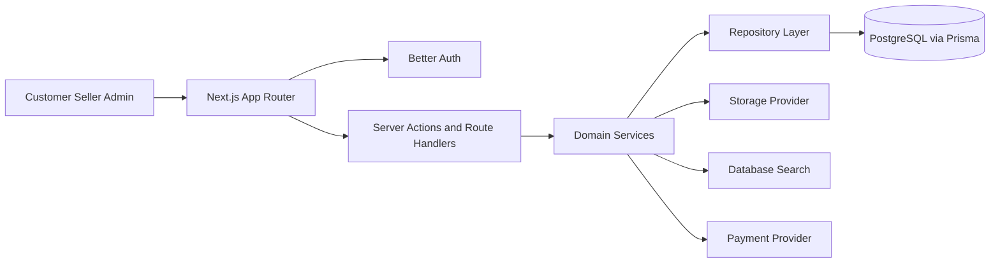
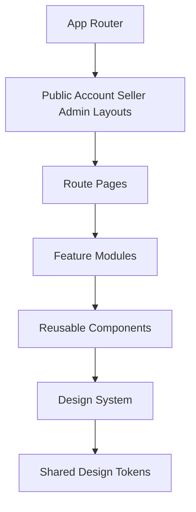
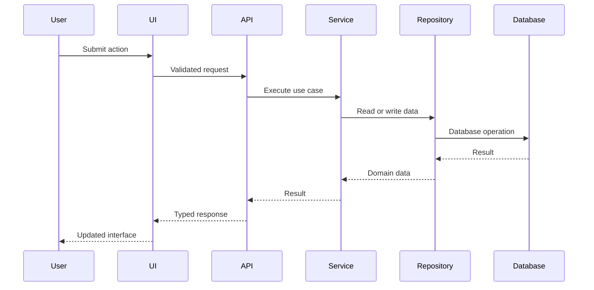

# Formivo 3D

Formivo 3D is a planned full-stack marketplace for ready-made and custom 3D-printed products. This repository currently contains Prompt 4: authentication, sessions, role management, protected routes, and the existing architecture, design-system, and database/domain-model foundation.

## Product identity

- Product: Formivo 3D
- Tagline: Imagine it. Find it. Print it.
- Currency: INR
- Primary visual direction: calm green marketplace UI with spacious layouts, rounded cards, minimal shadows, and product-focused imagery.

## Technology stack

- Next.js App Router
- React
- TypeScript strict mode
- Tailwind CSS v4 entrypoint mapped to shared CSS variables
- SCSS token, base, and component-module styling architecture
- Zod environment validation
- Jest and React Testing Library
- ESLint and Prettier
- pnpm 10

## Architecture







## Folder structure

```text
src/
  app/
  config/
  lib/
  styles/
docs/
tests/
.github/workflows/
```

Prompt 4 adds credential sign-up, sign-in, sign-out, HTTP-only session handling, buyer/seller/admin route protection, server-side role authorisation helpers, unauthorised states, and authentication unit tests. Later prompts will add concrete catalogue, dashboard, integration, and end-to-end workflows.

## Local setup

```bash
pnpm install
cp .env.example .env
pnpm dev
```

## Quality commands

These commands are configured for later phases, but the CI gate is intentionally a placeholder during the foundation-only prompt because the runnable marketplace is not complete yet. Linting uses the ESLint CLI rather than `next lint`, which is not available in Next.js 16.

```bash
pnpm lint
pnpm typecheck
pnpm test
pnpm build
```

## Environment variables

| Variable               | Required now          | Purpose                                                  |
| ---------------------- | --------------------- | -------------------------------------------------------- |
| `NEXT_PUBLIC_APP_URL`  | Yes                   | Canonical local application URL.                         |
| `DATABASE_URL`         | Yes for database work | PostgreSQL connection string used by Prisma.             |
| `BETTER_AUTH_SECRET`   | No                    | Reserved for future Auth.js or Better Auth adapter work. |
| `BETTER_AUTH_URL`      | No                    | Reserved for future Auth.js or Better Auth adapter work. |
| `GOOGLE_CLIENT_ID`     | No                    | Optional future Google OAuth.                            |
| `GOOGLE_CLIENT_SECRET` | No                    | Optional future Google OAuth.                            |
| `RAZORPAY_KEY_ID`      | No                    | Optional future Razorpay sandbox.                        |
| `RAZORPAY_KEY_SECRET`  | No                    | Optional future Razorpay sandbox.                        |

## Implementation phases

1. Architecture and project foundation.
2. Design system and reusable UI foundation.
3. Database schema, repository contracts, model contracts, Docker PostgreSQL setup, and seed data.
4. Authentication, sessions, roles, and permissions.
5. Customer storefront, categories, products, and discovery.
6. Search suggestions, filters, sorting, and accessible keyboard flows.
7. Custom requests, quotations, and custom projects.
8. Seller dashboard and product/order management.
9. Admin moderation, content, settings, and audit workflows.
10. Hardening, tests, visual review, performance, and deployment readiness.

## Design system

The visual foundation follows the approved green reference: fern primary actions, clay orange custom-order emphasis, warm neutral surfaces, thin borders, restrained radius, and subtle shadows. Runtime design tokens live in SCSS partials and are exposed to Tailwind utilities through `src/styles/globals.scss`. Reusable components use local barrels and colocated tests.

## Known limitations

- Prompt 4 implements local credential authentication and role-protected route foundations, while payments, storage, concrete catalogue repository implementations, and checkout workflows remain deferred.
- Payment and shipping integrations are intentionally deferred.

## CI notes

The initial workflow is intentionally limited to a foundation placeholder. Full linting, type checking, tests, build validation, migrations, seed verification, and visual review will be restored during the later hardening phase once the application implementation is complete.
