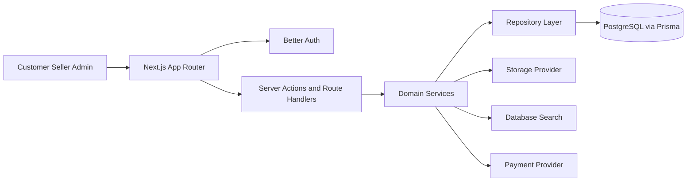
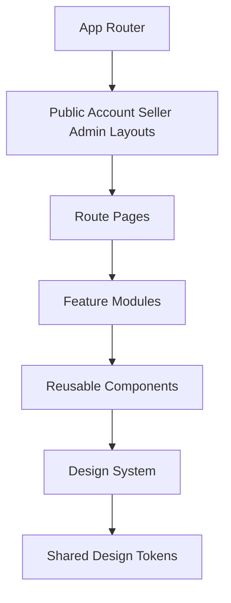
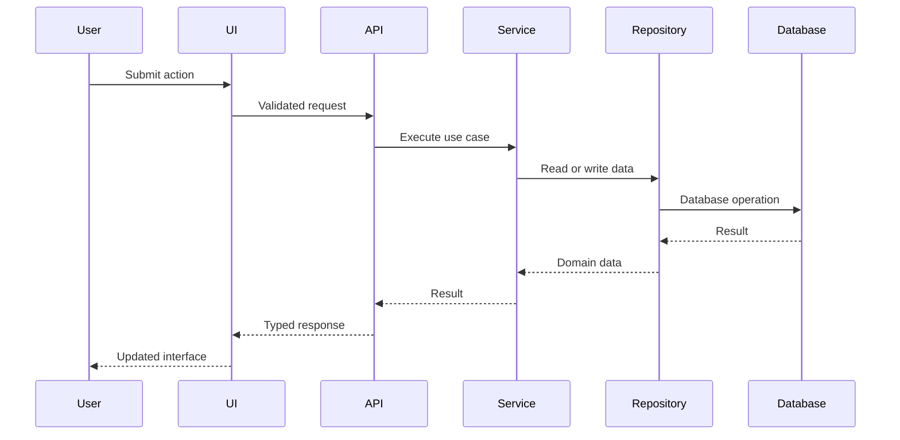

# Formivo 3D

Formivo 3D is a planned full-stack marketplace for ready-made and custom 3D-printed products. This repository currently contains Prompt 1: the architecture and project foundation.

## Product identity

- Product: Formivo 3D
- Tagline: Imagine it. Find it. Print it.
- Currency: INR
- Primary visual direction: calm green marketplace UI with spacious layouts, rounded cards, minimal shadows, and product-focused imagery.

## Technology stack

- Next.js App Router
- React
- TypeScript strict mode
- Tailwind CSS entrypoint with CSS design tokens
- SCSS-compatible global styling
- Zod environment validation
- Jest and React Testing Library
- ESLint and Prettier
- pnpm 10

## Architecture







## Folder structure

```text
src/
  app/
  config/
  lib/
  styles/
docs/
tests/
.github/workflows/
```

Later prompts will add feature modules, repositories, services, Prisma, authentication, storefront, dashboards, and end-to-end tests.

## Local setup

```bash
pnpm install
cp .env.example .env
pnpm dev
```

## Quality commands

These commands are configured for later phases, but the CI gate is intentionally a placeholder during the foundation-only prompt because the runnable marketplace is not complete yet.

```bash
pnpm lint
pnpm typecheck
pnpm test
pnpm build
```

## Environment variables

| Variable | Required now | Purpose |
| --- | --- | --- |
| `NEXT_PUBLIC_APP_URL` | Yes | Canonical local application URL. |
| `DATABASE_URL` | No | Added for future Prisma phases. |
| `BETTER_AUTH_SECRET` | No | Added for future authentication phases. |
| `BETTER_AUTH_URL` | No | Added for future authentication phases. |
| `GOOGLE_CLIENT_ID` | No | Optional future Google OAuth. |
| `GOOGLE_CLIENT_SECRET` | No | Optional future Google OAuth. |
| `RAZORPAY_KEY_ID` | No | Optional future Razorpay sandbox. |
| `RAZORPAY_KEY_SECRET` | No | Optional future Razorpay sandbox. |

## Implementation phases

1. Architecture and project foundation.
2. Design system and reusable UI foundation.
3. Database schema, migrations, repositories, and seed data.
4. Authentication, sessions, roles, and permissions.
5. Customer storefront, categories, products, and discovery.
6. Search suggestions, filters, sorting, and accessible keyboard flows.
7. Custom requests, quotations, and custom projects.
8. Seller dashboard and product/order management.
9. Admin moderation, content, settings, and audit workflows.
10. Hardening, tests, visual review, performance, and deployment readiness.

## Known limitations

- Prompt 1 intentionally does not implement feature pages, database models, authentication, payments, storage, or seed data.
- Database scripts are placeholders until the Prisma phase.


## CI notes

The initial workflow is intentionally limited to a foundation placeholder. Full linting, type checking, tests, build validation, migrations, seed verification, and visual review will be restored during the later hardening phase once the application implementation is complete.
