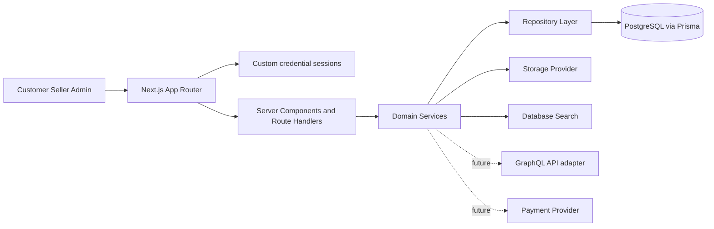
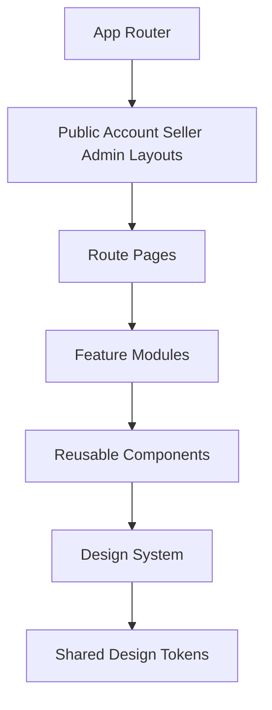
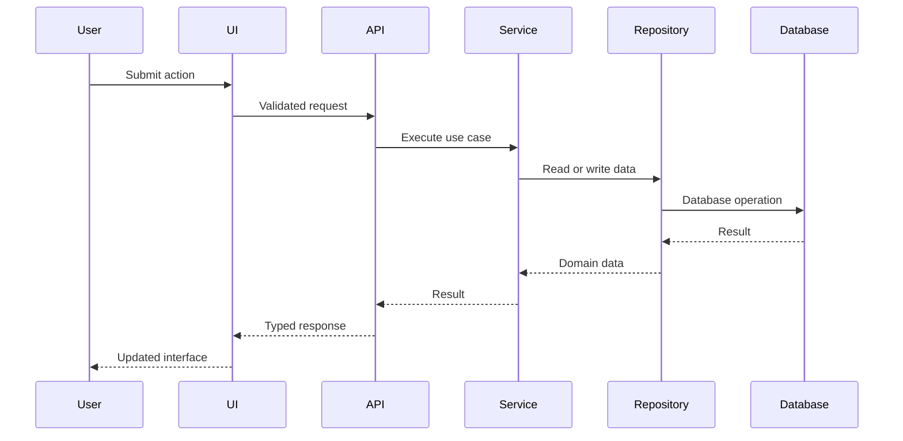

# Formivo 3D

Formivo 3D is a full-stack marketplace foundation for ready-made and custom 3D-printed products. It currently includes credential authentication, a PostgreSQL/Prisma domain model, database-backed deterministic search, category-guided discovery, accessible suggestions, recent searches, persistent URL filters, the buyer storefront foundation, and a database-backed seller workspace with onboarding and product management.

> **Architecture status:** `/search` and search suggestions use PostgreSQL. The homepage, general catalogue, category pages, and product detail pages still read a deterministic TypeScript fixture. Google OAuth, Better Auth, Razorpay, and GraphQL are planned integrations, not enabled features. See [Backend and data evolution](docs/BACKEND_EVOLUTION.md) for the audited migration plan.

## Product identity

- Product: Formivo 3D
- Tagline: Imagine it. Find it. Print it.
- Currency: INR
- Primary visual direction: calm green marketplace UI with spacious layouts, rounded cards, minimal shadows, and product-focused imagery.

## Technology stack

- Next.js App Router
- React
- TypeScript strict mode
- Tailwind CSS v4 entrypoint mapped to shared CSS variables
- SCSS token, base, and component-module styling architecture
- Zod environment validation
- PostgreSQL 16 and Prisma
- Jest and React Testing Library
- ESLint and Prettier
- pnpm 10

## Architecture







## Folder structure

```text
src/
  app/                         Public and role-based App Router routes
  components/                  Shared UI and public layout components
  config/                      Central product identity
  features/catalogue/          Catalogue models, data, services, components, tests
  features/seller/             Seller permissions, schemas, repositories, services, forms, and tests
  lib/                         Authentication, Prisma, and shared utilities
  styles/                      Tokens, base styling, and global Tailwind bindings
docs/
  ENVIRONMENT.md               Local, OAuth, secret, and production runbook
  BACKEND_EVOLUTION.md         Database and GraphQL delivery plan
tests/
.github/workflows/
```

Server Components compose public catalogue pages from typed catalogue and search services. The `/search` route queries published products from approved active sellers through a Prisma repository and deterministically ranks the returned catalogue records. Filters, sort order, and page selection remain in URL search parameters. Focused Client Components handle autocomplete, recent-search storage, navigation drawers, the product gallery, product options, and wishlist feedback. Catalogue money is represented in paise and formatted centrally as INR.

## Local setup

Prerequisites are Node.js, pnpm 10, Docker, and Docker Compose. No Google, payment, or GraphQL credentials are required for the features implemented today.

```bash
pnpm install
docker compose up -d postgres
cp .env.example .env
pnpm db:generate
pnpm db:migrate
pnpm db:seed
pnpm dev
```

The complete key-acquisition, local configuration, production secret-management, migration, and troubleshooting procedure is in [Environment and deployment configuration](docs/ENVIRONMENT.md).

## Quality commands

Linting uses the ESLint CLI rather than `next lint`, which is not available in Next.js 16. The production build script selects Next.js's webpack compiler explicitly because the Turbopack build did not terminate reliably in the constrained local tool environment; the emitted application remains a standard Next.js production build.

```bash
pnpm lint
pnpm typecheck
pnpm test
pnpm build
```

## Environment variables

| Variable                     | Required now                                        | Purpose                                                     |
| ---------------------------- | --------------------------------------------------- | ----------------------------------------------------------- |
| `NEXT_PUBLIC_APP_URL`        | Yes                                                 | Canonical application origin. This is intentionally public. |
| `DATABASE_URL`               | Yes for database-backed runtime and Prisma commands | Server-only PostgreSQL connection string.                   |
| `BETTER_AUTH_SECRET`         | No                                                  | Reserved; not consumed by current custom sessions.          |
| `BETTER_AUTH_URL`            | No                                                  | Reserved; not consumed until Better Auth is adopted.        |
| `GOOGLE_CLIENT_ID`           | No                                                  | Reserved until Google OAuth routes and UI are implemented.  |
| `GOOGLE_CLIENT_SECRET`       | No                                                  | Reserved server-only OAuth credential.                      |
| `RAZORPAY_KEY_ID`            | No                                                  | Reserved until payment integration.                         |
| `RAZORPAY_KEY_SECRET`        | No                                                  | Reserved server-only payment credential.                    |
| `CUSTOMER_DASHBOARD_ENABLED` | No; defaults to true                                | Customer dashboard feature gate.                            |
| `SELLER_DASHBOARD_ENABLED`   | No; defaults to true                                | Seller dashboard feature gate.                              |
| `SELLER_IMAGE_MAX_COUNT`     | No; defaults to 8                                   | Maximum product image metadata entries per seller listing.  |
| `SELLER_IMAGE_MAX_BYTES`     | No; defaults to 5 MiB                               | File-size limit enforced by the seller image abstraction.   |
| `ADMIN_DASHBOARD_ENABLED`    | No; defaults to true                                | Admin dashboard feature gate.                               |

Do not assume a feature is active because its variable appears in `.env.example`. Runtime integration status and exact setup steps are maintained in [`docs/ENVIRONMENT.md`](docs/ENVIRONMENT.md).

## Backend and GraphQL direction

The recommended product-stage architecture is a **single-repository modular monolith**. Next.js owns rendering and HTTP adapters; domain services own business rules; repository interfaces isolate Prisma and PostgreSQL. This avoids premature distributed-system overhead while leaving explicit seams for future extraction.

The next data milestone is to replace fixture-backed catalogue reads with a Prisma catalogue repository. GraphQL should follow as an optional typed transport over the same services, rather than bypassing repositories or duplicating business logic. Server Components should continue to load SEO-critical pages directly on the server; focused Client Components can use generated GraphQL operations for interactive dashboards and mutations.

See [`docs/BACKEND_EVOLUTION.md`](docs/BACKEND_EVOLUTION.md) for current-state findings, target and sequence diagrams, phased delivery, security controls, extraction criteria, and definition of done. See [`docs/ARCHITECTURE.md`](docs/ARCHITECTURE.md) for the repository-wide architecture record.

## Implementation phases

1. Architecture and project foundation.
2. Design system and reusable UI foundation.
3. Database schema, repository contracts, model contracts, Docker PostgreSQL setup, and seed data.
4. Authentication, sessions, roles, and permissions.
5. Customer storefront, categories, products, and discovery.
6. Deterministic database search, suggestions, recent searches, persistent filters, and accessible keyboard flows.
7. Custom requests, quotations, and custom projects.
8. Seller dashboard and product/order management.
9. Admin moderation, content, settings, and audit workflows.
10. Hardening, tests, visual review, performance, and deployment readiness.

## Design system

The visual foundation follows the approved green reference: fern primary actions, clay orange custom-order emphasis, warm neutral surfaces, thin borders, restrained radius, and subtle shadows. Runtime design tokens live in SCSS partials and are exposed to Tailwind utilities through `src/styles/globals.scss`. Reusable components use local barrels and colocated tests.

## Known limitations

- The homepage and `/products` catalogue still use the typed deterministic catalogue fixture from Prompt 5; `/search` is the first public product-discovery route backed by Prisma.
- Search uses deterministic field matching and application ranking. No semantic or AI search provider is configured or claimed.
- Persisted wishlist/cart state, checkout, payments, shipping, seller order transitions, quotations, payouts, and admin moderation are intentionally assigned to later prompts.
- Local credential authentication is available from Prompt 4; optional Google OAuth and Razorpay adapters remain deferred.
- Seller image management currently accepts deterministic local `/catalogue/` URLs. The provider validates image metadata and preserves a typed object-storage seam, but binary uploads and production object-storage credentials are not active yet.
- The Prompt 7 migration and seed are committed and validated at schema level. They were not applied in the implementation workspace because its Docker daemon was not running; start Docker and run `pnpm db:migrate && pnpm db:seed` locally.

## Catalogue routes

- `/` — marketplace homepage and featured discovery
- `/products` — complete catalogue with filtering, sorting, and pagination
- `/categories` — browse all active product categories
- `/categories/[slug]` — category-specific catalogue results
- `/products/[slug]` — product media, options, seller trust details, and related products
- `/search` — database-backed keyword search, category guidance, URL filters, sorting, and result states
- `/api/search/suggestions?q=phone` — typed product, category, seller, and popular-search suggestions

## Search and discovery

- Search parameters are validated with Zod and include keyword, category, price, material, colour, rating, customisation, seller location, processing time, delivery estimate, stock, sort, and page.
- Suggestion requests begin after two characters, debounce in the browser, return at most five entries, and support Arrow Up, Arrow Down, Enter, and Escape.
- Submitted searches are stored only in local browser storage, capped at five unique recent entries, and retain optional category context.
- The development seed includes minimal, adjustable, and foldable phone stands for the guided phone-stand workflow.

## Seller workspace

- `/seller` — database-backed revenue, order, product, inventory, and rating overview
- `/seller/onboarding` — persisted seller application and capability profile
- `/seller/profile` — owned store settings and capability management
- `/seller/products` — responsive seller product listing with status and lifecycle actions
- `/seller/products/new` — twelve-section product editor with draft and review submission actions
- `/seller/products/[productId]/edit` — ownership-protected product editing
- `/seller/products/[productId]/inventory` — product and variant inventory with reserved-stock protection

Product drafts remain private. Approved sellers can submit complete drafts for administrator review, but cannot publish them until an administrator changes the product to `APPROVED`. Seller publication, pause, duplication, archive, image metadata, inventory, and every lifecycle mutation are authorised server-side. Editing an approved or published product moves it back to a private draft and removes its public publication date.

## Demo credentials

After running the idempotent seed, all demo accounts use password `Formivo123!`.

- Seller: `seller@formivo.local`
- Customer: `buyer@formivo.local`
- Admin: `admin@formivo.local`
