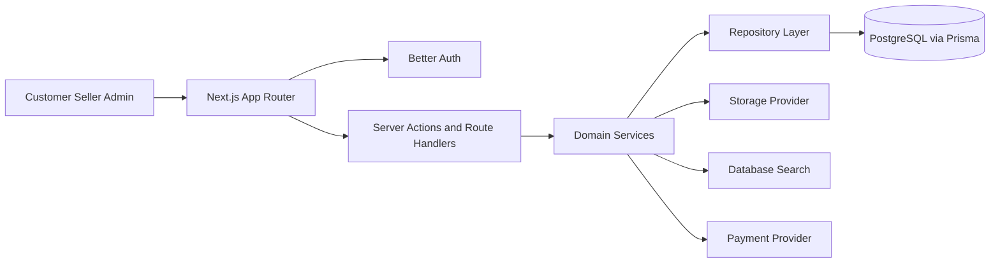
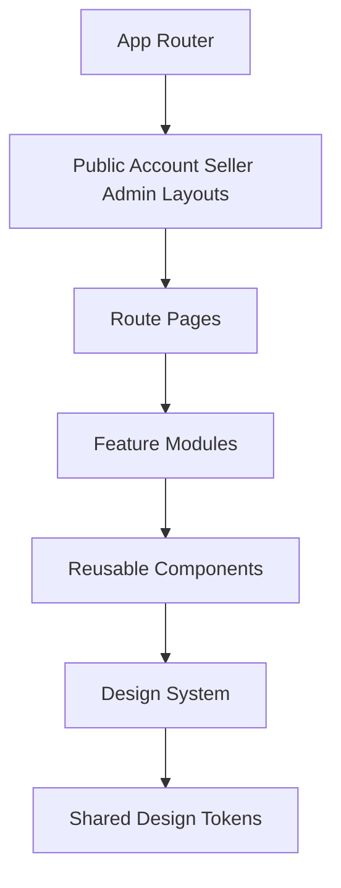
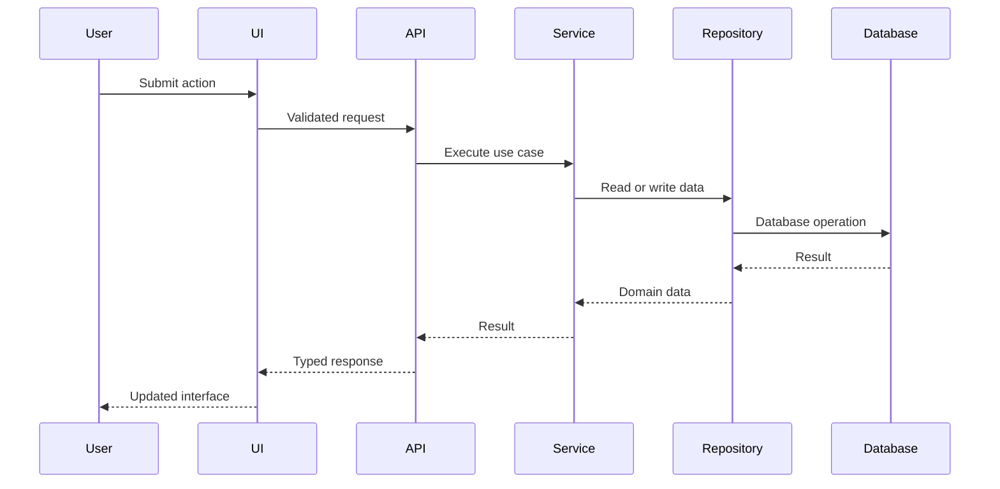

# Formivo 3D

Formivo 3D is a full-stack marketplace foundation for ready-made and custom 3D-printed products. The current implementation includes Prompt 6: deterministic database search, category-guided discovery, accessible suggestions, recent searches, persistent URL filters, responsive result states, and the existing buyer storefront and catalogue foundation.

## Product identity

- Product: Formivo 3D
- Tagline: Imagine it. Find it. Print it.
- Currency: INR
- Primary visual direction: calm green marketplace UI with spacious layouts, rounded cards, minimal shadows, and product-focused imagery.

## Technology stack

- Next.js App Router
- React
- TypeScript strict mode
- Tailwind CSS v4 entrypoint mapped to shared CSS variables
- SCSS token, base, and component-module styling architecture
- Zod environment validation
- Jest and React Testing Library
- ESLint and Prettier
- pnpm 10

## Architecture







## Folder structure

```text
src/
  app/                         Public and role-based App Router routes
  components/                  Shared UI and public layout components
  config/                      Central product identity
  features/catalogue/          Catalogue models, data, services, components, tests
  lib/                         Authentication, Prisma, and shared utilities
  styles/                      Tokens, base styling, and global Tailwind bindings
docs/
tests/
.github/workflows/
```

Server Components compose public catalogue pages from typed catalogue and search services. The `/search` route queries published products from approved active sellers through a Prisma repository and deterministically ranks the returned catalogue records. Filters, sort order, and page selection remain in URL search parameters. Focused Client Components handle autocomplete, recent-search storage, navigation drawers, the product gallery, product options, and wishlist feedback. Catalogue money is represented in paise and formatted centrally as INR.

## Local setup

```bash
pnpm install
docker compose up -d postgres
cp .env.example .env
pnpm db:generate
pnpm db:migrate
pnpm db:seed
pnpm dev
```

## Quality commands

Linting uses the ESLint CLI rather than `next lint`, which is not available in Next.js 16.

```bash
pnpm lint
pnpm typecheck
pnpm test
pnpm build
```

## Environment variables

| Variable               | Required now          | Purpose                                                  |
| ---------------------- | --------------------- | -------------------------------------------------------- |
| `NEXT_PUBLIC_APP_URL`  | Yes                   | Canonical local application URL.                         |
| `DATABASE_URL`         | Yes for database work | PostgreSQL connection string used by Prisma.             |
| `BETTER_AUTH_SECRET`   | No                    | Reserved for future Auth.js or Better Auth adapter work. |
| `BETTER_AUTH_URL`      | No                    | Reserved for future Auth.js or Better Auth adapter work. |
| `GOOGLE_CLIENT_ID`     | No                    | Optional future Google OAuth.                            |
| `GOOGLE_CLIENT_SECRET` | No                    | Optional future Google OAuth.                            |
| `RAZORPAY_KEY_ID`      | No                    | Optional future Razorpay sandbox.                        |
| `RAZORPAY_KEY_SECRET`  | No                    | Optional future Razorpay sandbox.                        |

## Implementation phases

1. Architecture and project foundation.
2. Design system and reusable UI foundation.
3. Database schema, repository contracts, model contracts, Docker PostgreSQL setup, and seed data.
4. Authentication, sessions, roles, and permissions.
5. Customer storefront, categories, products, and discovery.
6. Deterministic database search, suggestions, recent searches, persistent filters, and accessible keyboard flows.
7. Custom requests, quotations, and custom projects.
8. Seller dashboard and product/order management.
9. Admin moderation, content, settings, and audit workflows.
10. Hardening, tests, visual review, performance, and deployment readiness.

## Design system

The visual foundation follows the approved green reference: fern primary actions, clay orange custom-order emphasis, warm neutral surfaces, thin borders, restrained radius, and subtle shadows. Runtime design tokens live in SCSS partials and are exposed to Tailwind utilities through `src/styles/globals.scss`. Reusable components use local barrels and colocated tests.

## Known limitations

- The homepage and `/products` catalogue still use the typed deterministic catalogue fixture from Prompt 5; `/search` is the first public product-discovery route backed by Prisma.
- Search uses deterministic field matching and application ranking. No semantic or AI search provider is configured or claimed.
- Persisted wishlist/cart state, checkout, payments, shipping, seller dashboards, and admin moderation are intentionally assigned to later prompts.
- Local credential authentication is available from Prompt 4; optional Google OAuth and Razorpay adapters remain deferred.

## Catalogue routes

- `/` — marketplace homepage and featured discovery
- `/products` — complete catalogue with filtering, sorting, and pagination
- `/categories` — browse all active product categories
- `/categories/[slug]` — category-specific catalogue results
- `/products/[slug]` — product media, options, seller trust details, and related products
- `/search` — database-backed keyword search, category guidance, URL filters, sorting, and result states
- `/api/search/suggestions?q=phone` — typed product, category, seller, and popular-search suggestions

## Search and discovery

- Search parameters are validated with Zod and include keyword, category, price, material, colour, rating, customisation, seller location, processing time, delivery estimate, stock, sort, and page.
- Suggestion requests begin after two characters, debounce in the browser, return at most five entries, and support Arrow Up, Arrow Down, Enter, and Escape.
- Submitted searches are stored only in local browser storage, capped at five unique recent entries, and retain optional category context.
- The development seed includes minimal, adjustable, and foldable phone stands for the guided phone-stand workflow.
