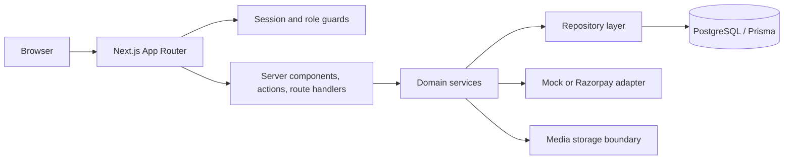
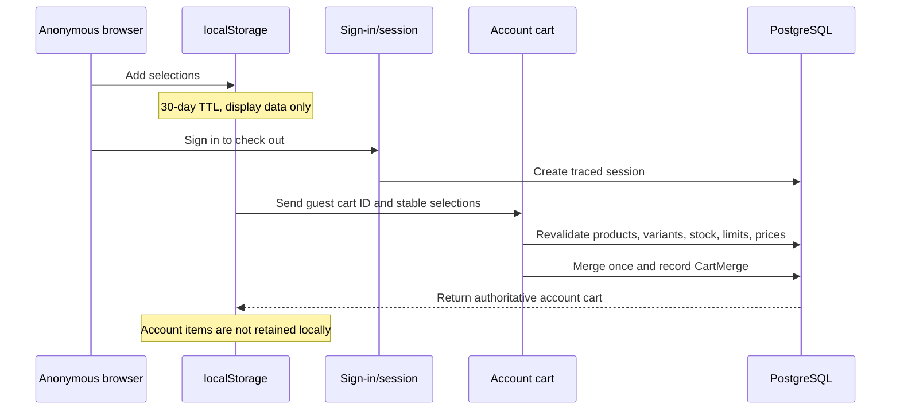

# Formivo 3D

Formivo 3D is a full-stack marketplace for ready-made and custom 3D-printed products. It includes public discovery, credential authentication, persistent customer carts, server-verified checkout, payments, buyer orders, seller operations, review eligibility, and administration workflows.

The application is a Next.js modular monolith: browser interactions stay small, business rules live in feature services, persistence is isolated behind repositories, and PostgreSQL is authoritative for identity, carts, prices, stock, orders, payments, and permissions.

## Stack

- Next.js App Router, React, and strict TypeScript
- SCSS modules, shared design tokens, and Tailwind CSS v4 utilities
- PostgreSQL 16, Prisma, and committed migrations
- Zod, React Hook Form, Zustand, and server actions
- Jest, React Testing Library, ESLint, Prettier, and GitHub Actions
- Mock payments for local demonstrations or Razorpay for configured environments

## Architecture



```text
src/
  app/                  Route groups, metadata endpoints, errors, APIs
  components/           Shared layout and accessible UI primitives
  config/               Product identity
  features/             Domain modules: auth, cart, checkout, seller, orders, reviews, admin
  lib/                  Auth, Prisma, payments, security, storage, validation
  models/               Cross-domain model contracts
  repositories/         Cross-domain repository contracts
  styles/               Tokens, reset, typography, and global styles
prisma/
  migrations/           Ordered production migrations
  schema.prisma         PostgreSQL data model
  seed.ts               Idempotent demo catalogue and account seed
docs/                   Architecture, environment, deployment, quality, and security records
```

Server Components read SEO-critical data. Client Components handle focused interactions such as autocomplete, dialogs, cart controls, and forms. Client values are never authoritative for permission, price, stock, payment, review eligibility, or fulfilment state.

More detail: [architecture](docs/ARCHITECTURE.md), [database](docs/DATABASE.md), and [backend evolution](docs/BACKEND_EVOLUTION.md).

## Authentication, sessions, and roles

- Sign-in creates a random 256-bit bearer token. Only its SHA-256 digest is stored in `Session`; the raw value stays in a secure, HTTP-only, SameSite cookie.
- Each database session has its own non-secret ID linked to the user and records bounded IP/user-agent context for tracing. Session IDs, not bearer tokens, should appear in diagnostics.
- Sessions expire after 30 days, are rotated on sign-in, are revoked on sign-out, and are rejected when the account is inactive. Revoked rows are retained for trace continuity; the raw bearer token is never retained.
- `/admin/**` requires the exact `ADMIN` role and `/seller/**` requires the exact `SELLER` role. The Next.js request proxy handles missing-cookie redirects; server layouts and actions remain the authoritative guards.
- Safe same-origin return paths preserve direct navigation through sign-in. External, protocol-relative, and cross-role destinations are rejected.
- Customers can browse and build a cart anonymously. Authentication becomes mandatory for checkout and account routes.

## Cart and checkout lifecycle



- Anonymous selections persist under `formivo-shopping-bag-v2` for 30 days. Price and stock snapshots are presentation-only.
- The first authenticated hydration merges the guest cart exactly once using a UUID plus a database uniqueness constraint. Existing account quantities are combined and clamped to current limits.
- Logged-in cart changes are debounced to the database and revalidated. Account cart items are intentionally omitted from local storage to avoid exposing the previous customer’s cart after sign-out on a shared browser.
- The cart hydrator reacts to sign-in and sign-out route transitions: sign-in adopts the current guest UUID once, while sign-out immediately replaces in-memory account state with a fresh empty guest cart.
- Checkout requires an active database session and records its non-secret session ID for later request-to-order tracing. It rechecks publication, seller status, variant status, quantity, price, and unreserved inventory in a serializable transaction.
- Payment success consumes reservations and clears the account cart in the same database transaction. Browser payment claims never mark an order paid.

## Local setup

Prerequisites: Node.js 22, pnpm 10.28.1, Docker, and Docker Compose.

```bash
cp .env.example .env
docker compose up -d postgres
pnpm install --frozen-lockfile
pnpm db:generate
pnpm db:migrate
pnpm db:seed
pnpm dev
```

Open `http://localhost:3000`. See [environment configuration](docs/ENVIRONMENT.md) for every variable and [deployment](docs/DEPLOYMENT.md) for the release order.

## Demo credentials

Run `pnpm db:seed` first. All seeded login accounts use `Formivo123!`.

| Role                         | Email                          | Landing page                   |
| ---------------------------- | ------------------------------ | ------------------------------ |
| Customer                     | `buyer@formivo.local`          | `/account`                     |
| Approved seller              | `seller@formivo.local`         | `/seller`                      |
| Administrator                | `admin@formivo.local`          | `/admin`                       |
| Pending seller demonstration | `pending-seller@formivo.local` | Not a seller dashboard account |

The seed is idempotent and includes all public fixture products and variants in PostgreSQL so every storefront cart selection can be revalidated and checked out. Demo credentials are for local/staging use only; never seed them into a real production customer database.

## Quality and production checks

```bash
pnpm format:check
pnpm typecheck
pnpm lint
pnpm test -- --runInBand --coverage
pnpm db:validate
pnpm build
```

GitHub Actions runs those checks against PostgreSQL 16 after `prisma migrate deploy` and the idempotent seed. The production build uses Next.js image optimisation, local font optimisation, route metadata, robots, sitemap, a web manifest, strict security headers, and route-level/root error boundaries.

Review records: [quality, accessibility, responsive, and performance](docs/QUALITY.md) and [security and rate limiting](docs/SECURITY.md).

## Deployment summary

Release in this order:

```bash
pnpm install --frozen-lockfile
pnpm db:generate
pnpm db:validate
pnpm db:deploy
pnpm build
pnpm start
```

Run migrations once per release, not from every replica. Use HTTPS, a TLS-enabled managed PostgreSQL database, encrypted secrets, backups, and a production Razorpay configuration for real payments. `RATE_LIMIT_SECRET` must be a unique random server-only value of at least 32 characters.

## Known limitations

- Public catalogue pages still render a deterministic TypeScript catalogue for fast demo delivery, while search, cart validation, checkout, orders, and dashboards use PostgreSQL. The seed mirrors every public product into PostgreSQL; the planned next step is one Prisma-backed catalogue read path.
- Authentication supports local credentials only. Email verification, password reset, MFA, OAuth, device/session management UI, and session revocation UI are not implemented.
- Fixed-window rate limits are atomic in PostgreSQL and cover authentication and search suggestions. At high global traffic, move counters to a managed distributed limiter and add policy coverage to every public mutation.
- Product media uses shipped SVG demo assets and a local URL storage adapter. Production seller uploads still require object storage, malware/content scanning, signed upload URLs, and a CDN.
- Razorpay requires real provider credentials and webhook setup. The mock provider is for local/demo environments and must remain disabled for production commerce.
- There is no browser-driven end-to-end suite or measured Lighthouse budget yet. CI covers component/domain tests, database migration/seed, type/lint/format checks, and the production build; cross-browser payment testing remains a release checklist item.
- Checkout reservation expiry does not yet have a scheduled worker that marks abandoned sessions expired and releases old reservations.

## Documentation

- [Architecture](docs/ARCHITECTURE.md)
- [Environment variables](docs/ENVIRONMENT.md)
- [Deployment](docs/DEPLOYMENT.md)
- [Security and rate limiting](docs/SECURITY.md)
- [Quality review](docs/QUALITY.md)
- [Database](docs/DATABASE.md)
- [Backend evolution](docs/BACKEND_EVOLUTION.md)
