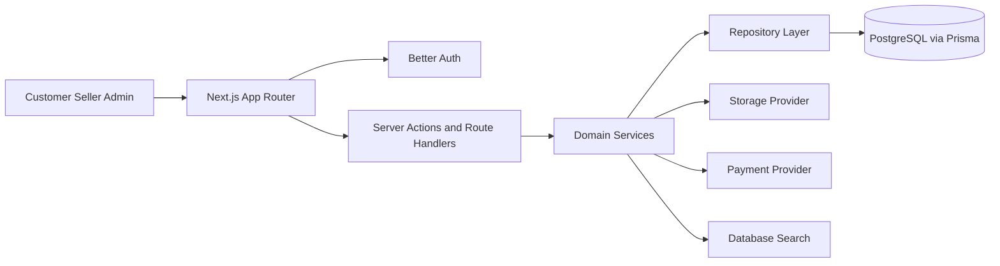
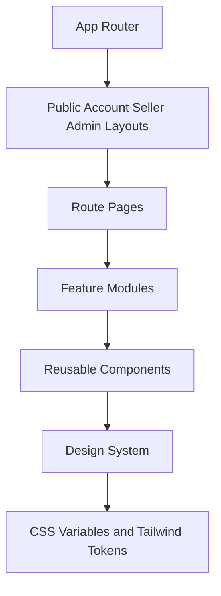
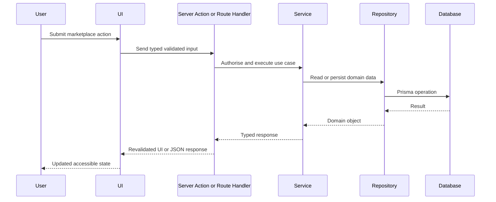

# Formivo 3D Architecture

## Proposal

Formivo 3D is implemented as a domain-oriented Next.js App Router application. Server-owned data will be loaded through Server Components, Server Actions, route handlers, repositories, and Prisma-backed services. Client Components will be reserved for focused browser interactions such as autocomplete, cart state, filters, dialogs, and multi-step drafts.

## Ten implementation prompts

1. Architecture and project foundation.
2. Design system and reusable UI foundation.
3. Database schema, migrations, repositories, and seed data.
4. Authentication, sessions, roles, and permissions.
5. Customer storefront, categories, products, and discovery.
6. Search suggestions, filters, sorting, and accessible keyboard flows.
7. Custom requests, quotations, and custom projects.
8. Seller dashboard and product/order management.
9. Admin moderation, content, settings, and audit workflows.
10. Hardening, tests, visual review, performance, and deployment readiness.

## High-level architecture



## Frontend composition



## Request flow



## Folder structure

```text
src/
  app/
  components/
  config/
  features/
  hooks/
  lib/
  models/
  repositories/
  services/
  stores/
  styles/
  types/
docs/
prisma/
public/
tests/
```

## Foundation decisions

- Central product identity lives in `src/config/site.ts`.
- Environment variables are validated with Zod in `src/lib/validation/env.ts`.
- Styling starts from CSS variables that match the green marketplace reference and is organised into token, base, and component-module SCSS layers.
- Tailwind v4 theme tokens are mapped to CSS custom properties in `src/styles/globals.scss`.
- Reusable UI primitives expose public APIs through local barrels and keep accessibility states in native HTML where possible.
- Strict TypeScript, ESLint, Prettier, Jest, React Testing Library, and CI are established before feature work.
- Prompt 4 defines credential authentication, HTTP-only session cookies, server-side role guards, middleware redirects for missing sessions, and role-specific dashboard entry points. Feature-specific persistence implementations remain deferred to later prompts.

## Prompt 5 catalogue decisions

- Public catalogue pages are Server Components and receive typed, normalised query parameters through the catalogue service.
- Sorting, filtering, and pagination are encoded in the URL so result views are shareable and work without client-side state hydration.
- A deterministic typed catalogue source powers Prompt 5 and mirrors the Prisma catalogue shape. A Prisma repository adapter can replace it without changing pages or presentation components when the expanded database seed is introduced.
- Product money values use integer paise inside the catalogue domain and are formatted centrally as INR at the presentation boundary.
- Reusable catalogue modules own product cards, grids, pricing, ratings, filters, pagination, galleries, and category navigation. Routes compose those modules rather than duplicating catalogue markup.
- Client Component boundaries are limited to the mobile navigation, mobile filter drawer, product gallery, wishlist feedback, and product option selection.
- Local SVG product artwork is stored under `public/catalogue` so marketplace pages remain visually stable and do not depend on third-party image hosts.
- Public marketplace routes provide loading, empty, error, and not-found recovery states without exposing technical error details.

## Prompt 6 search decisions

- `/search` is dynamic and uses a dedicated Prisma repository. It exposes only published products owned by approved, active sellers.
- Keyword matching is deterministic across product names, descriptions, category names, maker names, material, tags, and search keywords. Relevance is calculated with explicit field weights after the database has selected matching public records.
- The search service owns typed Zod-normalised parameters and a repository contract so a future dedicated search provider can replace Prisma without changing route components.
- Category, price, material, colour, rating, customisation, seller location, processing time, delivery estimate, stock, sort, and pagination state remain in the URL.
- The shared autocomplete client debounces `/api/search/suggestions`, validates its response, caps results at five, exposes combobox semantics, supports keyboard selection, and announces asynchronous result counts.
- Recent searches are a bounded browser-only preference. Server-owned catalogue results are not duplicated into client state.
- Search includes initial guidance, loading skeletons, normal results, empty recovery, suggestion failure, and database-unavailable states.
- The implementation is deterministic database search. No AI or semantic-search integration is configured.
