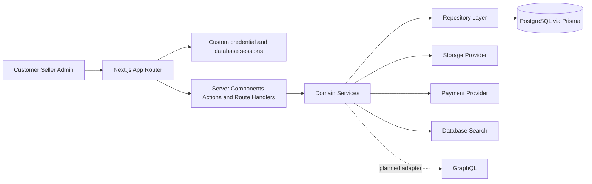
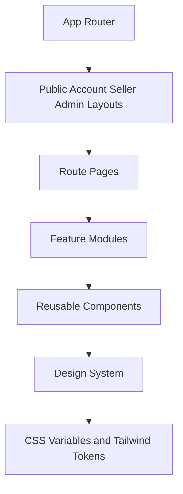
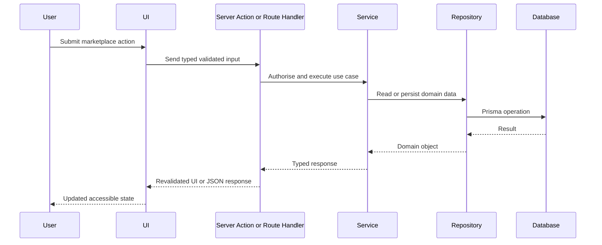
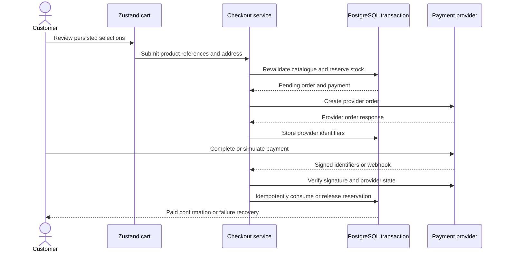
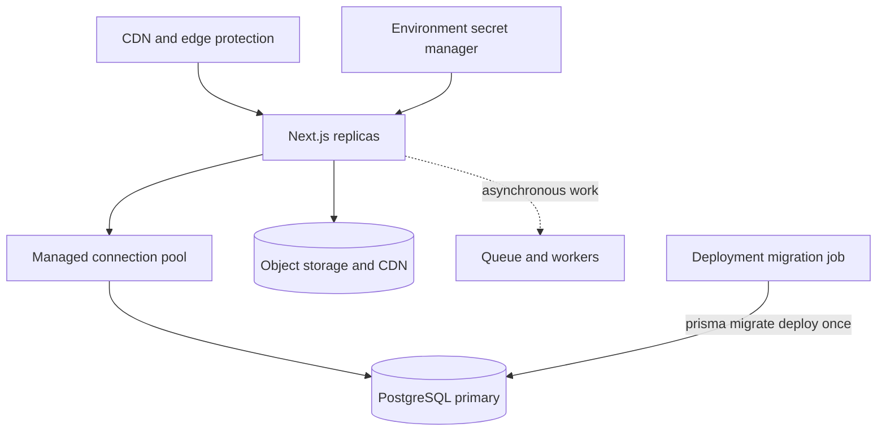

# Formivo 3D Architecture

## Proposal

Formivo 3D is implemented as a domain-oriented Next.js App Router modular monolith. Server-owned data is loaded through Server Components, route handlers, repositories, and Prisma-backed services. Client Components are reserved for focused browser interactions such as autocomplete, cart state, filters, dialogs, and multi-step drafts.

The modular monolith is the formal near-term deployment decision. It provides transactional consistency and a low-operational-overhead release unit while enforcing service and repository seams that support later backend extraction. A second backend repository is not justified until independent scale, clients, ownership, release cadence, or isolation becomes a measured requirement. The detailed decision and migration gates are recorded in [`BACKEND_EVOLUTION.md`](BACKEND_EVOLUTION.md).

## Ten implementation prompts

1. Architecture and project foundation.
2. Design system and reusable UI foundation.
3. Database schema, migrations, repositories, and seed data.
4. Authentication, sessions, roles, and permissions.
5. Customer storefront, categories, products, and discovery.
6. Search suggestions, filters, sorting, and accessible keyboard flows.
7. Custom requests, quotations, and custom projects.
8. Seller dashboard and product/order management.
9. Admin moderation, content, settings, and audit workflows.
10. Hardening, tests, visual review, performance, and deployment readiness.

## High-level architecture



## Frontend composition



## Request flow



## Folder structure

```text
src/
  app/
  components/
  config/
  features/
  hooks/
  lib/
  models/
  repositories/
  services/
  stores/
  styles/
  types/
docs/
prisma/
public/
tests/
```

## Foundation decisions

- Central product identity lives in `src/config/site.ts`.
- Environment variables are validated with Zod in `src/lib/validation/env.ts`.
- Styling starts from CSS variables that match the green marketplace reference and is organised into token, base, and component-module SCSS layers.
- Tailwind v4 theme tokens are mapped to CSS custom properties in `src/styles/globals.scss`.
- Reusable UI primitives expose public APIs through local barrels and keep accessibility states in native HTML where possible.
- Strict TypeScript, ESLint, Prettier, Jest, React Testing Library, and CI are established before feature work.
- Prompt 4 defines credential authentication, HTTP-only opaque session cookies, server-side role guards, middleware redirects for missing sessions, and role-specific dashboard entry points. The session token and account data are stored in PostgreSQL. Better Auth and Google OAuth are not currently initialised.

## Data ownership and API boundaries

- PostgreSQL is the intended system of record for marketplace and identity data. Prisma is a server-only persistence adapter.
- Static assets under `public/` are appropriate for shipped demo media. TypeScript fixture records are appropriate for tests and seeds, not as the production catalogue source of truth.
- Domain services own validation, visibility, authorisation, and transaction orchestration. Pages, route handlers, and future GraphQL resolvers are transport adapters and must not reproduce those rules.
- Repository contracts isolate persistence so test fixtures, Prisma, and a later dedicated search provider can be substituted deliberately.
- GraphQL is planned but absent. When introduced, it will share domain services, build authentication context from the HTTP-only session, use generated operation types and request-scoped loaders, and enforce complexity and rate limits.
- SEO-critical reads may remain direct Server Component-to-service calls. Browser GraphQL is most valuable for interactive account, seller, admin, and mutation workflows.

## Prompt 5 catalogue decisions

- Public catalogue pages are Server Components and receive typed, normalised query parameters through the catalogue service.
- Sorting, filtering, and pagination are encoded in the URL so result views are shareable and work without client-side state hydration.
- A deterministic typed catalogue source powers Prompt 5 and mirrors the Prisma catalogue shape. This is a transitional limitation: the homepage, catalogue, category, and product detail reads must move behind a Prisma catalogue repository before production launch.
- Product money values use integer paise inside the catalogue domain and are formatted centrally as INR at the presentation boundary.
- Reusable catalogue modules own product cards, grids, pricing, ratings, filters, pagination, galleries, and category navigation. Routes compose those modules rather than duplicating catalogue markup.
- Client Component boundaries are limited to the mobile navigation, mobile filter drawer, product gallery, wishlist feedback, and product option selection.
- Local SVG product artwork is stored under `public/catalogue` so marketplace pages remain visually stable and do not depend on third-party image hosts.
- Public marketplace routes provide loading, empty, error, and not-found recovery states without exposing technical error details.

## Prompt 6 search decisions

- `/search` is dynamic and uses a dedicated Prisma repository. It exposes only published products owned by approved, active sellers.
- Keyword matching is deterministic across product names, descriptions, category names, maker names, material, tags, and search keywords. Relevance is calculated with explicit field weights after the database has selected matching public records.
- The search service owns typed Zod-normalised parameters and a repository contract so a future dedicated search provider can replace Prisma without changing route components.
- Category, price, material, colour, rating, customisation, seller location, processing time, delivery estimate, stock, sort, and pagination state remain in the URL.
- The shared autocomplete client debounces `/api/search/suggestions`, validates its response, caps results at five, exposes combobox semantics, supports keyboard selection, and announces asynchronous result counts.
- Recent searches are a bounded browser-only preference. Server-owned catalogue results are not duplicated into client state.
- Search includes initial guidance, loading skeletons, normal results, empty recovery, suggestion failure, and database-unavailable states.
- The implementation is deterministic database search. No AI or semantic-search integration is configured.

## Prompt 7 seller decisions

- Seller onboarding persists both the mutable seller profile and an application snapshot. A customer may apply, while existing seller accounts can complete or revise pending information.
- Seller workspace reads and writes use Prisma-backed seller repositories and server actions. Client components are limited to form interaction, image/variant field arrays, confirmations, and responsive navigation.
- Product drafts remain private. A complete owned draft can move to `PENDING_REVIEW`; a seller can publish only after an administrator has moved it to `APPROVED`. Editing a published product removes it from public visibility and returns it to a private draft that must be resubmitted, so unmoderated content never remains public.
- Product lifecycle changes create `ProductApprovalEvent` records. Seller permission helpers enforce active accounts, ownership, verification state, and suspended-seller restrictions before repository mutations.
- Inventory is managed separately for the base product and its variants. Quantity cannot fall below reserved stock, and all submitted quantities and thresholds are validated on the server.
- Product image management uses a typed storage-provider contract. Prompt 7 activates a local public-path URL provider for deterministic development assets; direct binary uploads and production object-storage credentials remain deferred.
- Dashboard metrics are calculated from persisted products, order items, orders, inventory, and reviews. Currency is converted from Prisma decimal rupees to integer paise at the presentation boundary.
- Environment validation is composed from shared, customer, seller, and admin schemas. Variables remain in one Next.js runtime file but use domain prefixes and separate documentation sections to prevent dashboard-specific configuration from leaking across modules.

## Prompt 8 cart, checkout, and payment decisions

- The shopping bag is browser-owned interface state persisted with Zustand. It contains only display snapshots and stable product references; prices, seller eligibility, variants, purchase limits, and stock are reloaded from PostgreSQL before an order is created.
- Checkout creates one marketplace order and retains seller ownership on every immutable order-item snapshot. Tax is calculated per line, and shipping is calculated once per seller group before being allocated to the seller's first order item.
- Checkout preparation uses a serializable PostgreSQL transaction. It validates the delivery-address owner, creates the order and address snapshot, reserves inventory with optimistic predicates, records the initial status event, and creates the checkout and payment records under a unique idempotency key.
- External provider calls are kept outside database transactions. If provider-order creation fails, a compensating transaction marks the payment and checkout as failed, cancels the order, and releases every inventory reservation exactly once.
- Inventory remains reserved while payment is pending. A verified provider success atomically consumes stock, releases the reservation, marks the payment successful and order paid, and appends payment and order events. A verified failure releases reservations and cancels the unpaid order. Replayed confirmations and webhook events return the already-recorded result without repeating fulfilment mutations.
- Payment behaviour is behind a server-only adapter. The local mock returns an explicit simulated provider response and is labelled throughout the interface. Razorpay mode creates orders and fetches final payment state over the provider API, verifies checkout and webhook signatures with timing-safe comparisons, stores provider identifiers, and deduplicates webhook event IDs.
- Delivery addresses are database-owned and protected by authenticated ownership checks. Create, update, default-selection, and deletion mutations share Zod validation; deleting the only/default address safely promotes another owned address when available.
- The checkout UI never accepts a payment status from the browser. Browser callbacks provide provider identifiers and signatures only; the server adapter independently verifies them before any paid state is committed.



## Operational topology



Application replicas must not each race to apply migrations. A release job applies committed migrations once before traffic is promoted. Production uses an encrypted secret manager, TLS database connections, automated backups, connection monitoring, structured logs, and environment-specific credentials. Full procedures are maintained in [`ENVIRONMENT.md`](ENVIRONMENT.md).
