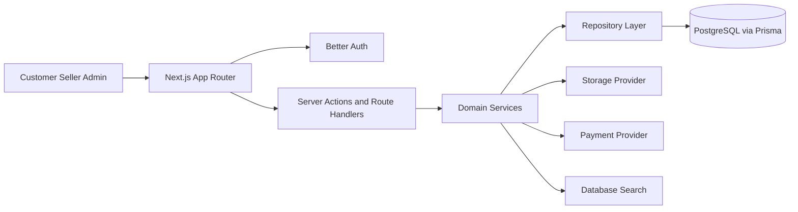
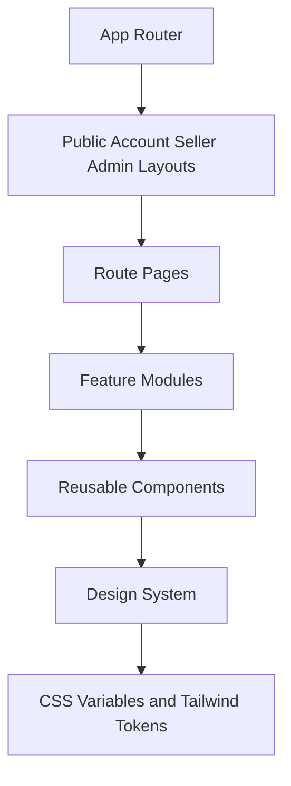
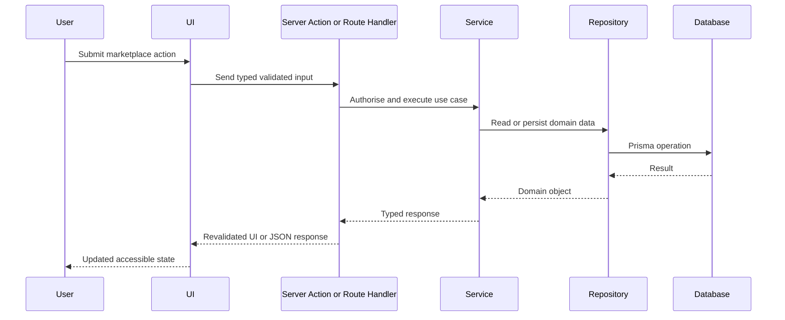

# Formivo 3D Architecture

## Proposal

Formivo 3D is implemented as a domain-oriented Next.js App Router application. Server-owned data will be loaded through Server Components, Server Actions, route handlers, repositories, and Prisma-backed services. Client Components will be reserved for focused browser interactions such as autocomplete, cart state, filters, dialogs, and multi-step drafts.

## Ten implementation prompts

1. Architecture and project foundation.
2. Design system and reusable UI foundation.
3. Database schema, migrations, repositories, and seed data.
4. Authentication, sessions, roles, and permissions.
5. Customer storefront, categories, products, and discovery.
6. Search suggestions, filters, sorting, and accessible keyboard flows.
7. Custom requests, quotations, and custom projects.
8. Seller dashboard and product/order management.
9. Admin moderation, content, settings, and audit workflows.
10. Hardening, tests, visual review, performance, and deployment readiness.

## High-level architecture



## Frontend composition



## Request flow



## Folder structure

```text
src/
  app/
  components/
  config/
  features/
  hooks/
  lib/
  models/
  repositories/
  services/
  stores/
  styles/
  types/
docs/
prisma/
public/
tests/
```

## Foundation decisions

- Central product identity lives in `src/config/site.ts`.
- Environment variables are validated with Zod in `src/lib/validation/env.ts`.
- Styling starts from CSS variables that match the green marketplace reference and is organised into token, base, and component-module SCSS layers.
- Tailwind v4 theme tokens are mapped to CSS custom properties in `src/styles/globals.scss`.
- Reusable UI primitives expose public APIs through local barrels and keep accessibility states in native HTML where possible.
- Strict TypeScript, ESLint, Prettier, Jest, React Testing Library, and CI are established before feature work.
- Prompt 3 defines the Prisma schema, seed data, domain model contracts, and repository interfaces while deferring concrete persistence implementations to later feature prompts.
