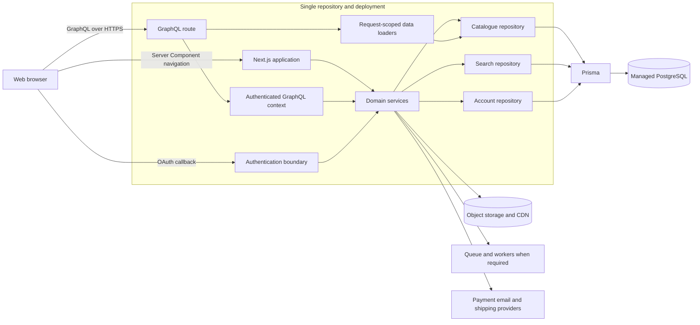
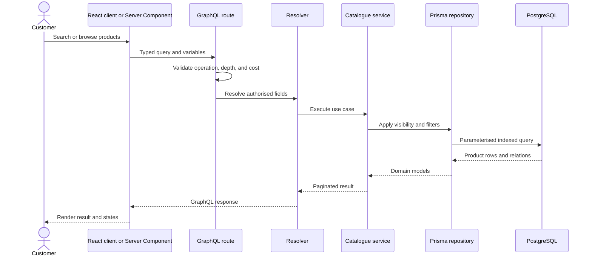
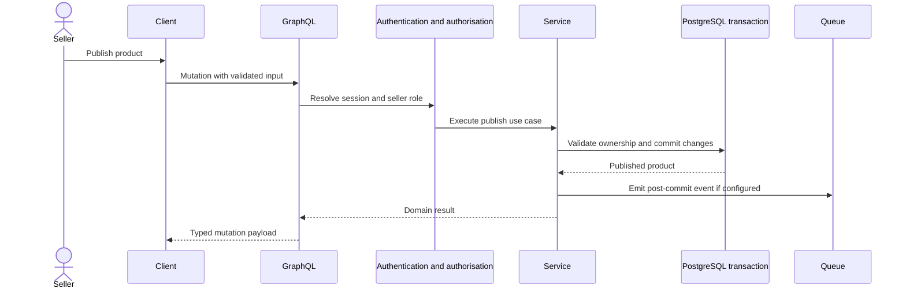

# Backend and data evolution plan

## Executive decision

Formivo 3D should remain a **single-repository modular monolith** for the current product stage. Next.js already provides the server runtime, server-only services, route handlers, Prisma repositories, and deployment unit needed by the marketplace. A second repository now would add cross-repository releases, duplicated contracts, authentication propagation, CORS, observability, and infrastructure without solving a current scaling constraint.

Use module boundaries as if the backend could be extracted later. Extract a dedicated API service only when independent scaling, multiple first-party clients, a separate backend team/release cadence, strict network isolation, or long-running workloads provide measurable value.

## Findings from the current repository

| Area                                              | Current state                                                | Required action                                                                |
| ------------------------------------------------- | ------------------------------------------------------------ | ------------------------------------------------------------------------------ |
| Database model                                    | PostgreSQL schema, migrations, seed, and Prisma client exist | Retain as the system of record                                                 |
| Search                                            | `/search` and its suggestions query Prisma                   | Retain and optimise with query metrics/indexes                                 |
| Homepage, catalogue, category, and product detail | Read the TypeScript fixture in `src/features/catalogue/data` | Move reads behind a database catalogue repository                              |
| Recent searches                                   | Browser `localStorage` preference, limited to five           | Keep local for anonymous convenience; optionally persist account history later |
| Product artwork                                   | Static SVG files in `public/catalogue` referenced by URLs    | Acceptable for seed/demo media; use object storage plus CDN for user uploads   |
| GraphQL                                           | No schema, server, generated types, or client exists         | Add only through the staged plan below                                         |
| Authentication                                    | Custom credentials and database sessions exist               | Harden current auth or deliberately adopt one supported auth library           |

Static files are appropriate for immutable frontend assets and deterministic demo/seed input. They are not an appropriate production source of truth for products, inventory, sellers, pricing, orders, or reviews. Those records belong in PostgreSQL and must be read through server-owned repositories. Browser storage may remain for non-authoritative preferences; it must not control price, stock, permissions, or order state.

## Target architecture

The GraphQL layer is a transport adapter, not a place for business logic or direct arbitrary database access. Both Server Components and GraphQL resolvers call the same services and repository contracts. This prevents rules from diverging and preserves a clean extraction seam.

## Read flow

## Write flow

## Delivery plan

### Phase 1 — remove production fixture reads

1. Introduce a catalogue repository contract for listing, product detail, category detail, filter facets, related products, and homepage collections.
2. Move Prisma-to-domain mapping into one database adapter and share the existing public-visibility predicate: product is published, `publishedAt` is set, and seller is approved and active.
3. Inject the database repository into catalogue services. Keep the fixture adapter only for isolated unit tests and Storybook-style development, not runtime routes.
4. Update homepage, `/products`, `/categories`, `/categories/[slug]`, and `/products/[slug]` to await database services.
5. Expand the idempotent seed for development and automated acceptance tests.
6. Add integration tests against PostgreSQL for visibility, inventory, facets, ordering, and pagination.

This phase provides the requested database-backed product without GraphQL and should be completed first.

### Phase 2 — add GraphQL as an API adapter

1. Select one maintained server integration compatible with the deployed Next.js runtime (for example GraphQL Yoga) and expose one Node.js route such as `/api/graphql`.
2. Define schema modules by domain (`catalogue`, `account`, `seller`, `order`) and explicit input/payload types. Prefer cursor pagination for externally consumed growing collections.
3. Build request context from the existing HTTP-only session; apply authorisation in services and field policies, never only in the UI.
4. Add request-scoped loaders to prevent N+1 relation queries.
5. Generate TypeScript operation and resolver types in CI. Commit documents, not handwritten duplicated response interfaces.
6. Add persisted/allow-listed operations for production, query depth and complexity limits, body/time limits, structured errors, rate limiting, and tracing. Disable unrestricted introspection in public production environments unless operationally required.
7. Test resolvers as adapters and retain domain/integration tests beneath them.

GraphQL does not replace Prisma: Prisma remains the server-side data-access implementation. GraphQL also does not make search inherently faster; indexes, query design, caching, and eventually a dedicated search index address search scale.

### Phase 3 — client integration

1. Keep initial SEO-critical catalogue reads in Server Components where an extra browser round trip provides no benefit.
2. Use generated GraphQL documents from focused Client Components for interactive pagination, saved searches, dashboards, mutations, and optimistic updates.
3. Choose a lightweight typed client initially. Adopt a normalised cache only when cross-view cache coordination is demonstrably needed.
4. Send cookies with same-origin requests and enforce CSRF protection for cookie-authenticated mutations.
5. Define consistent loading, empty, partial-error, unauthorised, and retry states.

Do not expose `DATABASE_URL`, Prisma, provider secrets, or privileged service methods to client bundles.

### Phase 4 — scale by evidence

- Add database pool monitoring, slow-query logging, composite indexes based on real plans, caching for safe public reads, and read replicas when measurements justify them.
- Move uploaded models and images to object storage; retain metadata and ownership in PostgreSQL.
- Add queues for email, media processing, search indexing, and provider webhooks that should not block requests.
- Adopt a dedicated search engine only when PostgreSQL relevance, typo tolerance, faceting latency, or catalogue size no longer meets defined service objectives.
- Extract the GraphQL/API modules to a backend repository only after an extraction trigger is met.

## Extraction-ready boundary

If a separate backend becomes necessary, move `services`, repository contracts, GraphQL schema/resolvers, workers, and Prisma ownership into the service. Publish a versioned GraphQL contract and generated client artifact. The Next.js repository then contains presentation, operations, and generated types only. During migration, route traffic through the same origin or an API gateway to avoid changing browser security assumptions.

Extraction triggers should be objective: sustained API load needs scaling different from rendering, mobile/partner clients require an independently versioned API, backend releases block frontend delivery, regulatory isolation is mandated, or dedicated backend ownership exists. Repository count is not itself a scalability feature.

## Definition of done

- No production route imports catalogue fixture data.
- PostgreSQL is the authoritative source for products, sellers, inventory, prices, reviews, and orders.
- Every public query enforces publication and seller-approval rules server-side.
- GraphQL operations have generated types, bounded complexity, authentication tests, and observable latency/error metrics.
- Secrets remain server-only and are managed independently by environment.
- Database migrations are automated, backed up, and rehearsed for rollback/forward recovery.
